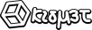

# κισμέτ

kismet

Protocol for distributed systems governance

> Live by the dice, but never go all in - David Vennik

## About

In distributed systems, there is a not commonly understood distinction between leader selection and consensus. 

Leadership is the right to publish data. If this right can be bought or stolen for less cost than honest mining, then the entire ledger is untrustworthy.

Consensus is the way that all nodes agree on which data is considered to be correct or "canonical", also called the "best chain", which is decided in Bitcoin type blockchains by the series of blocks with the lowest cumulative sum of hashes, called the "heaviest", as smaller hashes are more rare and require more attempts to discover.

Kismet separates leadership selection from consensus by creating a separate chain using Proof of Work for producing a special tokens that issue the right to be a validator, that then are lined up in a queue for a classical consensus based on Tendermint Core that gives fast, regular blocks, while not requiring the complexity of staking, and eliminating the vulnerability to dishonestly acquired stake.

[Whitepaper](doc/whitepaper.md)

[Roadmap](doc/roadmap.md)

## Building

todo: make a thing that can be built

## License
